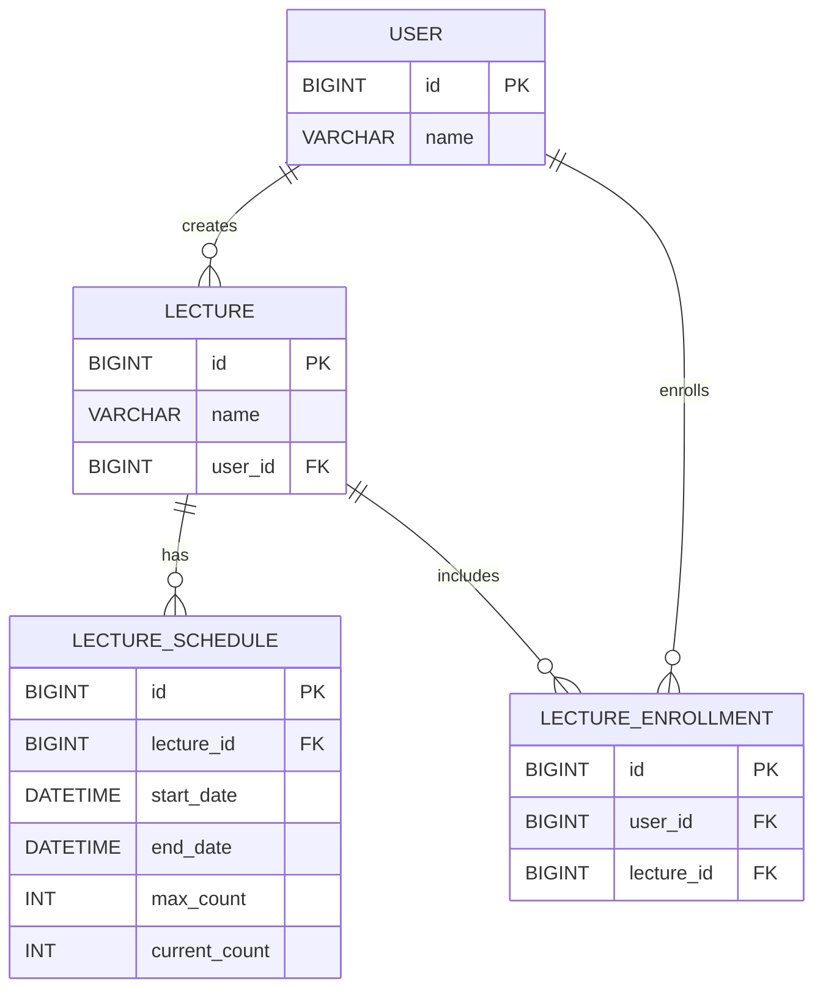

## ERD 

## 비관적 락(Pessimistic Lock)과 낙관적 락(Optimistic Lock)

### 비관적 락 (Pessimistic Lock)

비관적 락은 데이터베이스에서 동시성 문제를 해결하기 위해 사용되는 방법 중 하나입니다. 이 방식은 데이터에 대한 접근을 차단하여 다른 트랜잭션이 해당 데이터에 접근하지 못하도록 합니다. 주로 다음과 같은 상황에서 사용됩니다:

- **경쟁이 치열한 환경**: 여러 트랜잭션이 동시에 동일한 데이터를 수정할 가능성이 높은 경우.
- **데이터 무결성이 중요한 경우**: 데이터의 일관성을 보장해야 할 필요가 있는 경우.

#### 특징
- **락을 즉시 획득**: 트랜잭션이 시작될 때 데이터에 대한 락을 획득합니다.
- **성능 저하 가능성**: 다른 트랜잭션이 락이 해제될 때까지 대기해야 하므로 성능이 저하될 수 있습니다.
- **데드락 위험**: 여러 트랜잭션이 서로의 락을 기다리는 상황이 발생할 수 있습니다.

### 낙관적 락 (Optimistic Lock)

낙관적 락은 데이터에 대한 충돌이 드물다고 가정하고, 트랜잭션이 완료될 때까지 락을 사용하지 않는 방식입니다. 이 방식은 주로 다음과 같은 상황에서 사용됩니다:

- **충돌이 드물게 발생하는 경우**: 데이터 수정이 빈번하지 않거나, 읽기 작업이 많은 경우.
- **성능을 중시하는 경우**: 락을 사용하지 않기 때문에 성능이 향상될 수 있습니다.

#### 특징
- **락을 사용하지 않음**: 트랜잭션이 시작될 때 락을 획득하지 않고, 데이터 수정 시점에만 충돌을 검사합니다.
- **버전 관리**: 데이터에 버전 정보를 추가하여, 수정 시점에 버전이 일치하는지 확인합니다.
- **충돌 발생 시 재시도**: 만약 충돌이 발생하면 트랜잭션을 재시도하거나 오류를 반환합니다.

### 결론

낙관적 락은 성능을 높이고 충돌이 드물게 발생하는 환경에서 사용하는게 좋다고 생각하고, 어쩔 수 없는 경우에는 비관적 락을 사용해야 할 수도 있습니다. 비관적 락은 데이터 무결성을 보장하는 데 유리하지만 성능 저하의 위험이 있으므로 사용에 주의해야합니다.

